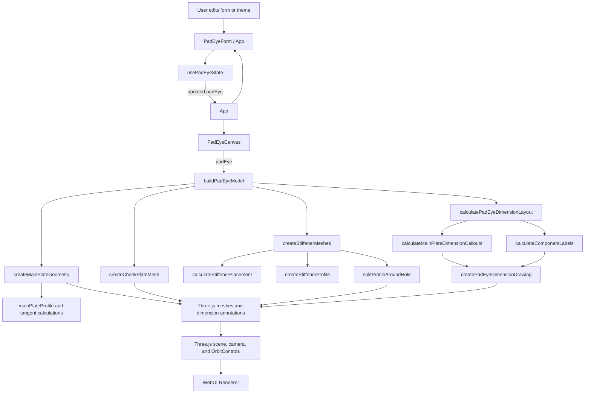

<!-- README.md -->

# Pad Eye Design Tool

A browser-based engineering configurator for building a pad-eye plate assembly and inspecting its dimensions in a live Three.js viewport.

## Technology

- React 19 and Vite
- Three.js with `OrbitControls` (direct Three.js; not React Three Fiber)
- Tailwind CSS 4

## Run Locally

```bash
npm install
npm run dev
```

Useful checks:

```bash
npm run lint
npm run build
```

## Features

- Responsive layout with a scrollable engineering form and interactive 3D preview.
- Live model updates as form values change.
- Orbit controls, automatic camera fit, and a model-scaled zoom-out limit.
- Light/dark theme toggle; the selection is stored in local storage.
- 3D callouts for main-plate dimensions and cheek/stiffener values.
- Main plate has tangent side connections to its circular upper profile and a centered pin hole.
- Cheek plates share the main hole center. Up to four can be configured, stacked two per face.
- Stiffeners support flat, angled, and curved profiles. They are placed on both main-plate faces, derive height from the plate outline, and are split around the hole when needed.
- Endpoint stiffeners can define a base height; the main-plate base and tangent-to-arc outline extend to match.

## Engineering Inputs

| Section        | Inputs and behavior                                                                                                                                                        |
| :------------- | :------------------------------------------------------------------------------------------------------------------------------------------------------------------------- |
| General        | Pad-eye ID and units. The supplied defaults use millimeters.                                                                                                               |
| Main plate     | Thickness, arc-center height, left/right base widths, outer radius, and hole diameter. The hole center is at the arc center. The uppermost point is at height plus radius. |
| Cheek plates   | Zero to four plates total, distributed two per face. Each plate has an outer radius and thickness; its inner hole matches the main-plate hole.                             |
| Stiffeners     | Unlimited dynamic list with type, side/center position, offset, thickness, and top size. Flat and angled profiles also use bottom size; curved profiles use bottom radius. |
| Base stiffener | When a left/right stiffener reaches the corresponding main-plate base edge, a Base Height input is shown and the main-plate side extends to that height.                   |

## Project Structure

```text
src/
  components/       React form, reusable fields, and Three.js canvas
  data/             Default pad-eye JSON
  dimensions/
    calculations/   Dimension callout layout and component labels
    draw/           Three.js lines, label sprites, and dimension drawing
  geometry/
    calculations/   Tangents, profiles, stiffener placement, and hole clipping
    draw/           Main plate, cheek plate, and stiffener mesh construction
    buildPadEyeModel.js
    materials.js
  hooks/             Pad-eye form state and update operations
```

## Function Flow



## State and Geometry

`src/data/defaultPadEye.json` provides the initial engineering values. `usePadEyeState` owns the editable pad-eye object and immutable update operations. `PadEyeCanvas` rebuilds and renders the Three.js model from that state.

Geometry calculations are kept separate from mesh drawing. Dimension layout calculations are likewise separate from the code that draws Three.js lines and text sprites. The project does not generate a separate render-manifest JSON file.
