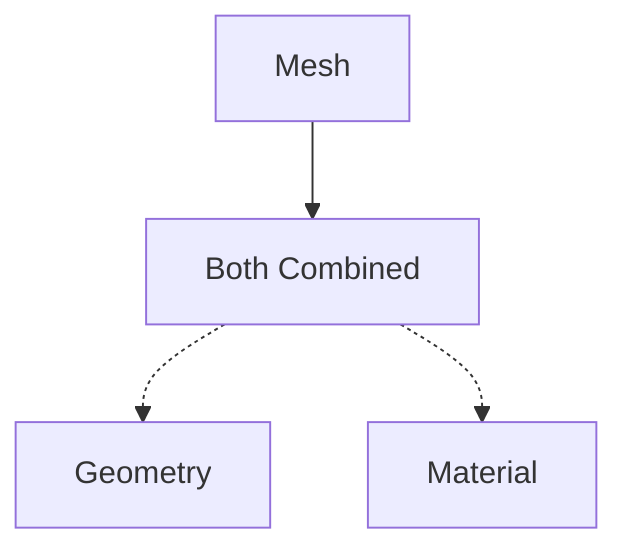
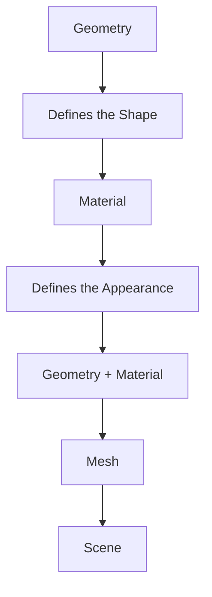
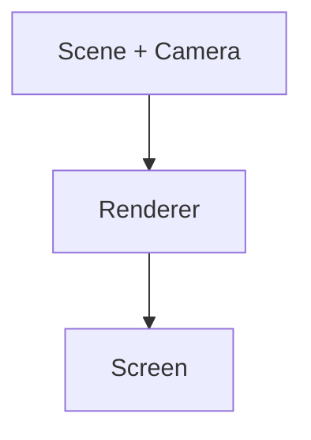
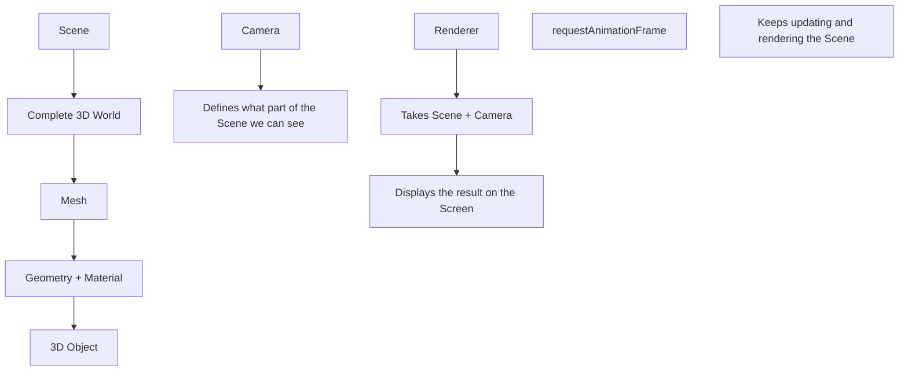

# Three.js Notes

## 1. Scene

The first important concept in Three.js is the Scene.
The Scene represents the complete 3D world.
In simple words, we can say that the Scene is the complete world of our 3D application.
Everything that exists in our 3D world is added to the Scene.
An object may be visible to the camera or it may not be visible to the camera, but the object can still exist inside the Scene.
Example:

```js
const scene = new THREE.Scene();
```

Think of the Scene as the real world.
The complete world exists around you, even though you cannot see everything at the same time.
In Three.js:

> Scene = Complete 3D World

## 2. Camera

The Camera represents the perspective or viewpoint from which we see the 3D world.
The Camera does not show everything that exists inside the Scene.
It only shows the part of the 3D world that is within its view.
Example:

```js
const camera = new THREE.PerspectiveCamera(
  75,
  window.innerWidth / window.innerHeight,
  0.1,
  1000,
);
```

Think of the Camera like your eyes or a real camera.
The complete world exists around you, but you can only see a specific portion of that world.
In Three.js:

> Camera = Perspective / Viewpoint

## 3. Mesh

A Mesh is a 3D object.
A Mesh is created by combining two main things:



In simple words:

> Mesh = Geometry + Material

## 4. Geometry

Geometry defines the shape and structure of a 3D object.
Examples:

- Box
- Sphere
- Plane
- Cylinder
- Cone
  Example:

```js
const geometry = new THREE.BoxGeometry(1, 1, 1);
```

This creates the geometry for a box or cube.
In simple words:

> Geometry = Shape of the Object

## 5. Material

Material defines the appearance and properties of the surface of the object.
For example, Material can define:

- Color
- How the object reacts to light
- Whether the surface is shiny
- Whether the surface is transparent
- Other visual properties
  Example:

```js
const material = new THREE.MeshBasicMaterial({
  color: 0xff0000,
});
```

This creates a red material.
In simple words:

> Material = Appearance / Properties of the Shape

## 6. Creating a Mesh

Once we have Geometry and Material, we can combine them to create a Mesh.
Example:

```js
const mesh = new THREE.Mesh(geometry, material);
```

Then we add the Mesh to the Scene:

```js
scene.add(mesh);
```

The process is:



## 7. Renderer

The Renderer is responsible for displaying the 3D world on the screen.
It takes the Scene and Camera and renders what the Camera can see.
Example:

```js
const renderer = new THREE.WebGLRenderer();
renderer.setSize(window.innerWidth, window.innerHeight);
document.body.appendChild(renderer.domElement);
```

Then we render the Scene using the Camera:

```js
renderer.render(scene, camera);
```

The basic flow is:



## 8. requestAnimationFrame()

requestAnimationFrame() is used to create an animation loop.
It tells the browser to execute a function before the next screen repaint.
Example:

```js
function animate() {
  requestAnimationFrame(animate);
  renderer.render(scene, camera);
}
animate();
```

This allows us to continuously update and render the 3D world.
For example, if we want to rotate a cube:

```js
function animate() {
  requestAnimationFrame(animate);
  mesh.rotation.x += 0.01;
  mesh.rotation.y += 0.01;
  renderer.render(scene, camera);
}
animate();
```

The cube continuously rotates because the animation function keeps running.

# Complete Three.js Example

```js
import \* as THREE from "three";
// 1. Create the Scene
const scene = new THREE.Scene();
// 2. Create the Camera
const camera = new THREE.PerspectiveCamera(
75,
window.innerWidth / window.innerHeight,
0.1,
1000
);
// Move the Camera away from the object
camera.position.z = 5;
// 3. Create Geometry
const geometry = new THREE.BoxGeometry(
1,
1,
1
);
// 4. Create Material
const material = new THREE.MeshBasicMaterial({
color: 0xff0000
});
// 5. Create Mesh
const mesh = new THREE.Mesh(
geometry,
material
);
// 6. Add Mesh to Scene
scene.add(mesh);
// 7. Create Renderer
const renderer = new THREE.WebGLRenderer();
// Set Renderer size
renderer.setSize(
window.innerWidth,
window.innerHeight
);
// Add Renderer to the HTML document
document.body.appendChild(
renderer.domElement
);
// 8. Animation Loop
function animate() {
requestAnimationFrame(animate);
    // Rotate the Mesh
    mesh.rotation.x += 0.01;
    mesh.rotation.y += 0.01;
    // Render the Scene through the Camera
    renderer.render(
        scene,
        camera
    );
}
// Start the animation
animate();
```

# Final Summary

Scene
= Complete 3D World
Camera
= Perspective / Viewpoint
Mesh
= 3D Object
Geometry
= Shape of the Object
Material
= Appearance / Properties of the Object
Renderer
= Displays the 3D World on the Screen
requestAnimationFrame()
= Continuously updates and renders the 3D World

# Easy Way to Remember


